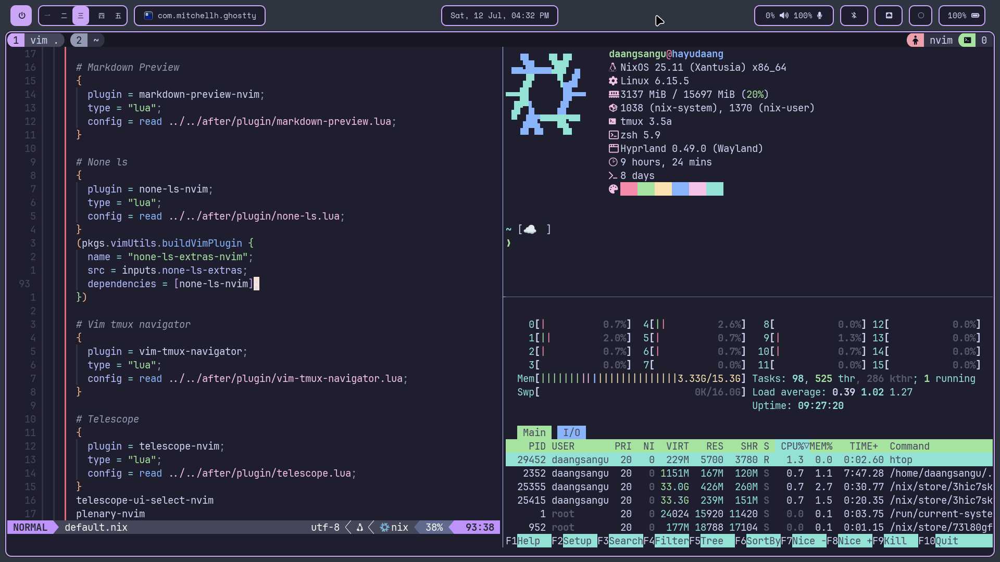

# NixOS Config

My NixOS and Home Manager configurations ft. Hyprland. This repo is my "nix version" of my dotfiles repo [here](https://github.com/januarpancaran/dotfiles)



## Defaults

| Variable            | Default               |
| :------------------ | :-------------------- |
| Desktop Environment | Hyprland              |
| Bar                 | Waybar                |
| Notification Daemon | Dunst                 |
| Shell               | Zsh                   |
| Text Editor         | Neovim + VsCode       |
| Gtk Theme           | Dracula               |
| GTK Icon Theme      | Tela-nord-dark        |
| Cursor              | Bibata-Modern-Classic |
| Terminal            | Ghostty               |
| Browser             | Google Chrome         |
| File Manager        | Nautilus              |
| App Launcher        | Rofi                  |
| Logout              | Wlogout               |
| Screenshot          | Hyprshot              |

## Main Keybindings

| App                 | Keybinding        |
| :------------------ | :---------------- |
| Terminal            | Super + T         |
| Kill Active         | Super + Q         |
| Browser             | Super + B         |
| App Launcher        | Super + R         |
| File Manager        | Super + E         |
| Text Editor         | Super + C         |
| Logout              | Super + L         |
| Screenshot (Window) | Super + P         |
| Screenshot (Area)   | Super + Shift + S |
| Screenshot (Full)   | Super + Shift + P |

## Installation

This dotfiles uses nixos-unstable channel, so if you haven't change your channel, be sure to do so by doing this:

```shellSession
# nix-channel --remove nixos
# nix-channel --add https://nixos.org/channels/nixos-unstable nixos
# nix-channel --update
```

Also, if you haven't installed home manager, be sure to do so by doing this:

```shellSession
$ nix-channel --add https://github.com/nix-community/home-manager/archive/master.tar.gz home-manager
$ nix-channel --update
$ nix-shell '<home-manager>' -A install
```

Then, proceed with the installation:

```bash
# Make a folder in your home folder
mkdir -p $HOME/.config/nixos # Or any other places that you want

# Clone this repo
git clone --depth 1 https://github.com/januarpancaran/nixos-config.git
cd nixos-config
cp -r {system,home-manager,flake.nix} $HOME/.config/nixos

# Copy your hardware configuration
cp /etc/nixos/hardware-configuration.nix $HOME/.config/nixos/system
```

Before rebuilding your system and home manager, you need to change all user and hostname variables in this configuration. Also, feel free to change the packages before rebuilding in case you don't want programs that i use.

```bash
# Rebuild your system and home-manager configuration
cd $HOME/.config/nixos
# System
sudo nixos-rebuild switch --flake . --upgrade --verbose

# Home manager
home-manager switch --flake . --verbose
```

After rebuilding for the first time, you can use "nh" to rebuild your system and home-manager

```bash
# System
nh os switch

# Home manager
nh home switch
```
